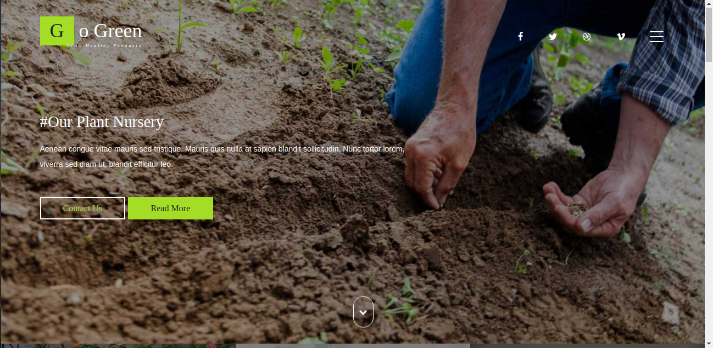
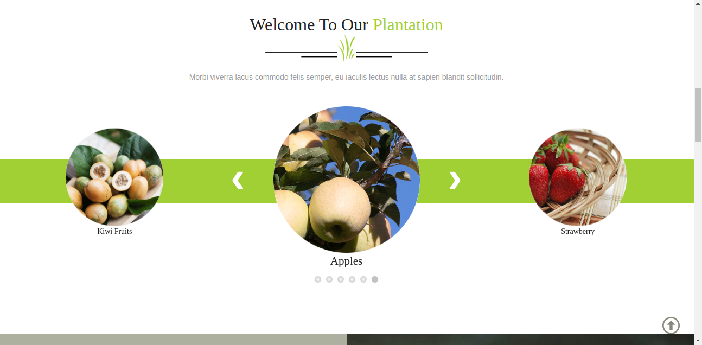
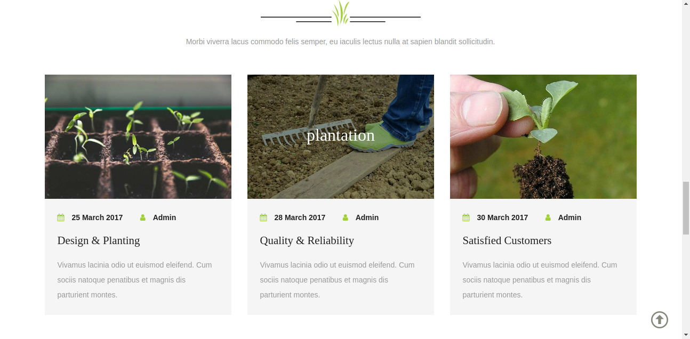
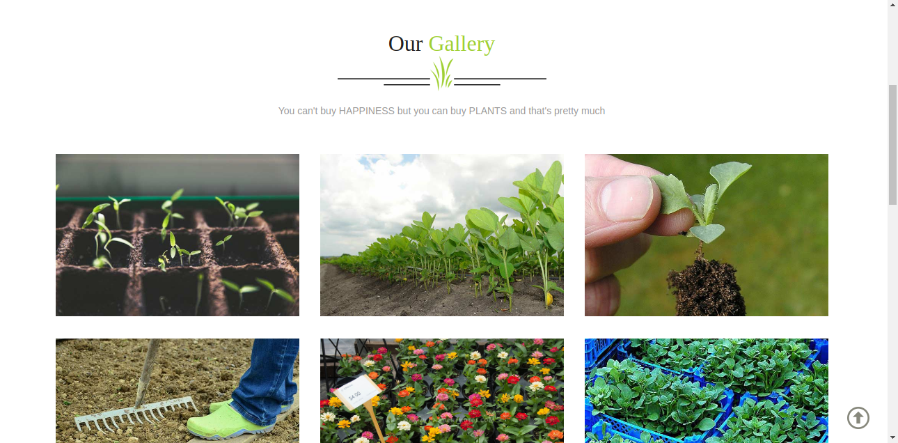
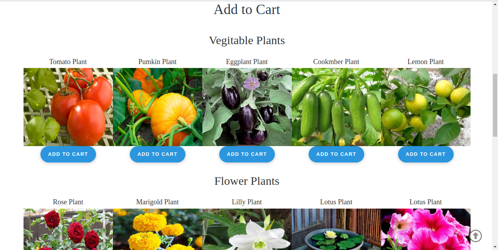
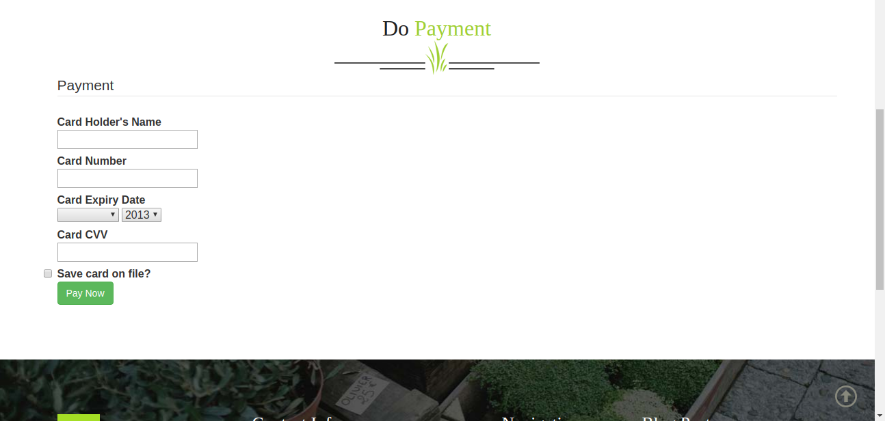

# Nursery-management-system-master

The management of seedlings can be done in a better way with minimum care, cost and maintenance as the nursery area is small. Manipulation of growing conditions for plants becomes easy. ... The seed requirement of nursery raised crops is less as compared to direct seed sowing of the same crop due to better management.


### This is a Static Website used to Buy a Nurcery Plant
**** 
   
****
  
****  
  
****  
  
****  
  
****  
  
****  
  
****  
  
****  
  
****  
  
****  

### References
****
 ```
 w3schools          :    https://www.w3schools.com/
 W3layouts          :    http://w3layouts.com/
 Youtube videos     :    https://www.youtube.com/
  ```
 ### Live Demo of webpage
 ****
   [Preview of the project available here!!!](https://akshayrrao.github.io/Nursery-management-system-master/)

Thank you....
